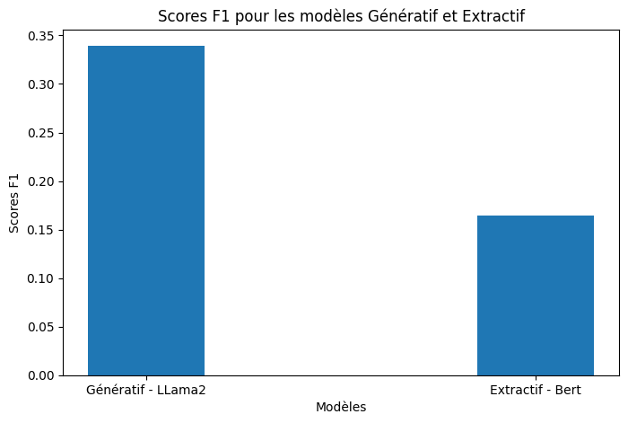
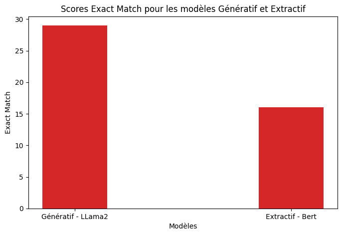

# Information Extraction: BERT vs LLaMA2

This project compares **two NLP approaches for information extraction from incident reports**:

- **Extractive model:** Fine-tuned BERT for slot filling
- **Generative model:** LLaMA2 using a prompt-based question-answering approach

The goal is to evaluate which approach performs better for extracting structured information from unstructured text.

## Dataset

The dataset contains **incident descriptions with labeled arguments (slots)**.  
Each example includes:

- a text describing an incident
- structured fields such as location, cause, or type of incident

## Models

### Extractive Approach (BERT)

- Model: `bert-base-cased`
- Task: slot filling
- Architecture: BERT encoder + linear classifier
- Training with cross-entropy loss

### Generative Approach (LLaMA2)

- Model: `Llama-2-7b-chat`
- Method: prompt-based information extraction
- Output formatted as JSON

## Results

| Model | F1 Score | Exact Match |
|------|------|------|
| **LLaMA2 (Generative)** | **0.38** | **35** |
| **BERT (Extractive)** | 0.21 | 3 |

## Images and Observations

- The **generative model (LLaMA2)** significantly outperforms the extractive BERT model.
- LLaMA2 produces more accurate structured outputs from raw text.
- The extractive approach struggles with tokenization issues caused by BERT subword tokenization.
- The F1 score for LLaMA2 may **underestimate its real performance**, as metrics like **BLEU or semantic similarity** could better capture its output quality.

## Notebook

Run the project in Google Colab:

[Open Notebook](https://colab.research.google.com/drive/1HsfE4WYk75S03aE5aFGEc3IjWbrHuz_E)
