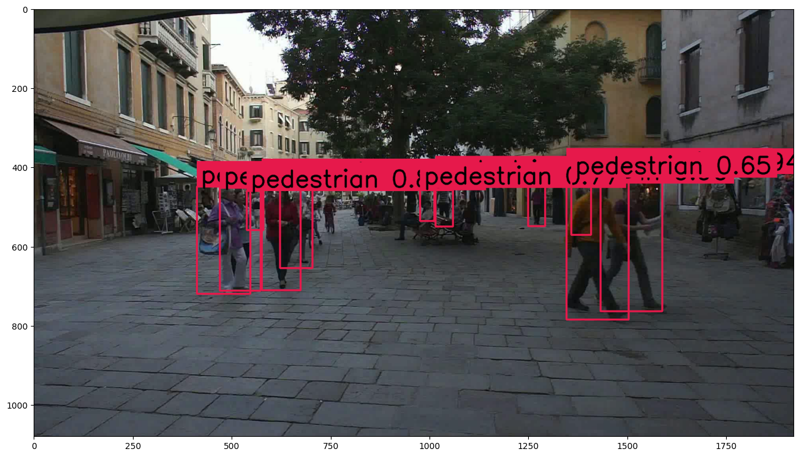

# Multi-Object Tracking with YOLOv8 + ByteTrack (KITTI)

This project implements a **multi-object pedestrian tracking pipeline** using **YOLOv8 for detection**, **ByteTrack for tracking**, and **optical flow** to improve motion consistency between frames.

Dataset: **KITTI Multi-Object Tracking**

## Pipeline

Video Frame → YOLOv8 Detection → Optical Flow → ByteTrack → Object Trajectories

## Results

| Metric | Score |
|------|------|
| MOTA | **0.9539** |
| IDF1 | **0.8848** |
| Precision | **0.9771** |
| Recall | **0.9871** |

## Observations

- High recall (98.7%) shows strong pedestrian detection.
- ByteTrack maintained stable identities for most objects.
- Identity switches occurred mainly during **occlusions or object crossings**.

## Notebook

Run the project in Google Colab:

[Open Notebook](https://colab.research.google.com/drive/1yQtlAEtNV-M2YP8tyFe9y2iB0xONhmdd)

## Example Output

