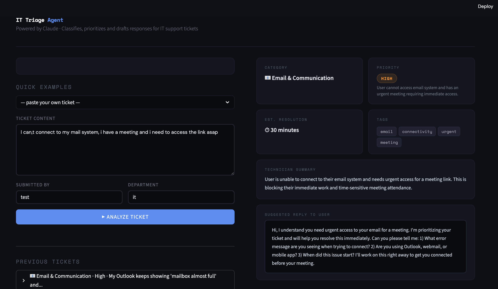

#  IT Triage Agent

An AI-powered IT support ticket triage tool built with Claude (Anthropic) and Streamlit.

## What it does

Paste any IT support ticket and the agent automatically:

- **Classifies** the ticket into a category (Network, Security, Hardware, etc.)
- **Prioritizes** it (Critical / High / Medium / Low) with a reason
- **Summarizes** the issue for the technician
- **Drafts a reply** to send back to the user
- **Estimates resolution time** and generates relevant tags

## Demo



## Setup

### 1. Clone the repo
```bash
git clone https://github.com/TherryOndo20/data-projects.git
cd it-triage-agent
```

### 2. Create a virtual environment
```bash
python3 -m venv venv
source venv/bin/activate
pip install --upgrade pip
```

### 3. Install dependencies
```bash
pip install -r requirements.txt
```

### 4. Set your Anthropic API key
```bash
export ANTHROPIC_API_KEY=your_api_key_here
```
Get a free API key at [console.anthropic.com](https://console.anthropic.com)

> ⚠️ Never commit your API key. Add `.env` to your `.gitignore`.

### 5. Run the app
```bash
streamlit run app.py
```

The app will open at `http://localhost:8501`

## Project structure
```
it-triage-agent/
├── app.py              # Streamlit UI
├── agent.py            # Claude API logic & prompt engineering
├── requirements.txt
└── README.md
```

## Tech stack

- **Claude (claude-sonnet-4)** — LLM for ticket analysis
- **Streamlit** — Web interface
- **Anthropic Python SDK** — API client

## Key design decisions

- **Structured JSON output**: The agent is prompted to return strict JSON, making the output reliable and parseable for downstream automation
- **Prompt engineering**: System prompt encodes IT triage domain expertise (priority criteria, category taxonomy) so the model behaves consistently
- **Graceful error handling**: Falls back cleanly if model output is malformed
- **Stateful history**: Session-based ticket history so technicians can review past analyses

## Author

Therry Jeannick Anguezome Ondo  
[github.com/TherryOndo20](https://github.com/TherryOndo20/data-projects)